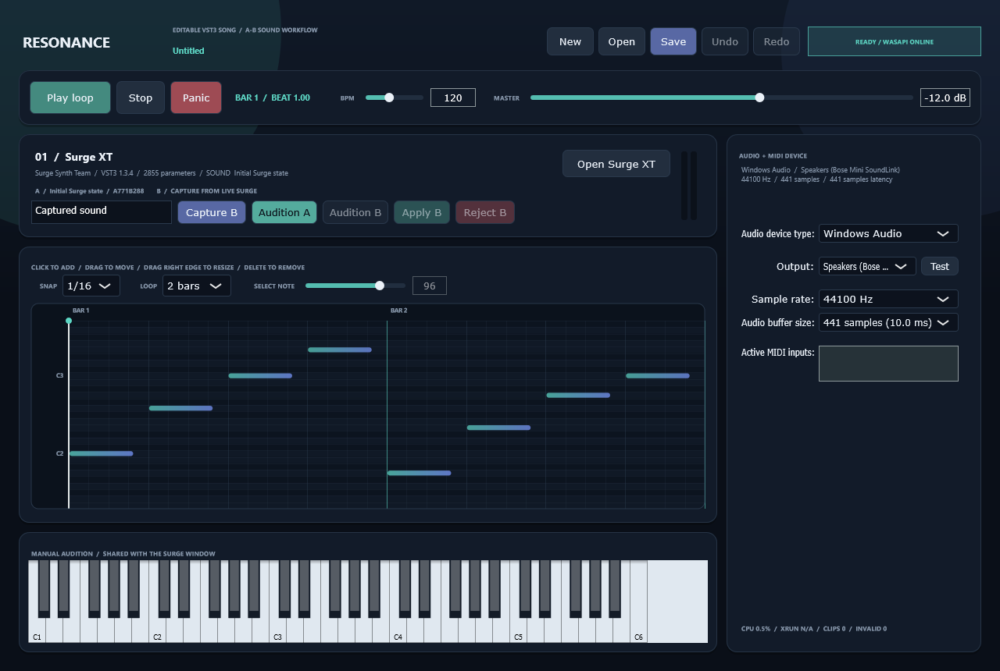
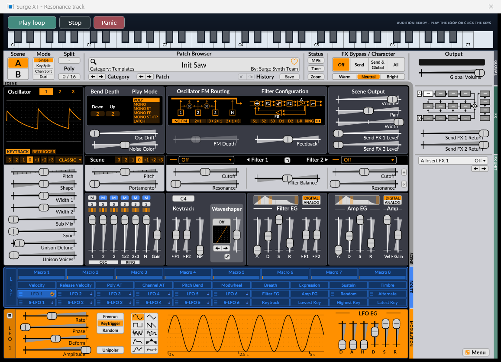

# Resonance Music Editor

Resonance Music Editor is a clean-room restart of the game-music editor, with VST3 hosting as a foundation rather than a later add-on. The project now has its first editable song and sound-design slice plus the host-side foundation for previewable edit commands: a native Windows editor with real-time WASAPI output, a piano roll, lossless song projects, one inventory-approved Surge XT instrument track, and a host-owned A/B sound workflow.

The current scope is deliberately one instrument track and one looping clip. Notes, tempo, loop length, grid snap, velocity, and an explicitly accepted named Surge state are editable and saveable. A version-1 JSON command can now build a validated non-mutating note candidate and apply it as one Undo transaction, but its visual preview/audition UI and any natural-language model integration remain later work alongside factory-preset indexing, arrangement, automation, and game-state music tools.



The native Surge window also has a Resonance audition strip, so sound design can be heard without returning to the main window:



## Documentation

Start with the [documentation index](docs/README.md). It separates current behavior, planned design, and dated acceptance evidence so historical checkpoints are not mistaken for the live implementation.

- [Product vision](docs/PRODUCT_VISION.md) - the game-music focus, manual and AI editing principles, and explicit non-goals.
- [Architecture](docs/ARCHITECTURE.md) - processes, threads, data flow, real-time invariants, and extension seams.
- [Development guide](docs/DEVELOPMENT.md) - Windows setup, local dependencies, build, run, test, and troubleshooting.
- [Project format](docs/PROJECT_FORMAT.md) - the versioned `.resonance.json` contract and migration rules.
- [VST3 hosting](docs/VST3_HOSTING.md) - scanning, quarantine, identity, loading, state, and native-editor behavior.
- [AI editing design](docs/AI_EDITING_DESIGN.md) - the implemented command foundation and the remaining reversible editing plan.
- [Testing and release](docs/TESTING_AND_RELEASE.md) - automated gates, listening gates, artifacts, and release checklist.
- [Roadmap](docs/ROADMAP.md) - completed foundations and the ordered route to a game-music production editor.
- [Current handoff](HANDOFF.md) - exact live status, known limitations, and a ready-to-paste fresh-task prompt.

See [CONTRIBUTING.md](CONTRIBUTING.md) before changing code, schemas, or real-time behavior.

## Run the playable editor

From PowerShell:

```powershell
.\bin\ResonanceMusicEditor.exe
```

Keep the master level low for the first listen. It defaults to `-12 dB`, and transport is stopped on startup. The earlier diagnostic WAV that sounded distorted is not used as a sound-quality baseline for this editor.

## Edit and save a song

- Click empty piano-roll space to add a note.
- Drag a note to change its beat and pitch; drag its highlighted right edge to resize it.
- Select a note and edit velocity, or right-click/press **Delete** to remove it.
- Choose `1/32`, `1/16`, `1/8`, or `1/4` grid snap and a one-, two-, four-, or eight-bar loop.
- Use **Undo/Redo** or `Ctrl+Z` / `Ctrl+Y` while playback continues.
- Use **Save** to create a `.resonance.json` song. **Open** restores the notes, tempo, loop, snap, and exact versioned Surge state.

Unsaved project changes are marked with `*`. New, Open, and window close ask before discarding project edits, an unapplied B, or live Surge state that matches neither known live-equivalent snapshot.

## Compare and apply a Surge sound

1. Press **Open Surge XT** and choose or design a sound in Surge's native window.
2. Give the candidate a name and press **Capture B** in Resonance.
3. Use **Audition A** and **Audition B** to compare the accepted project sound with the captured candidate through the same Surge instance.
4. Press **Apply B** to make the candidate one dirty, undoable project transaction, or **Reject B** to restore A without changing the song.

Save writes only the accepted project sound. An unapplied B remains preview state and is not silently substituted into the project. Undo/Redo restores the corresponding live Surge state as well as the saved model. The exact saved SHA-256 protects project bytes; the UI separately tracks the live-equivalent hash returned by Surge after restore because one sound can have lifecycle-dependent opaque encodings. The current snapshot-first workflow intentionally does not parse or index Surge's vendor-specific `.fxp` library; see `docs/ADR-0004-host-owned-sound-snapshots.md`.

## Proven checkpoints

### M5 edit-command foundation

The first M5 host-only slice was implemented on 2026-08-09 without changing song-project schema version 1 or editor version 0.3.0:

- added a strict version-1 `editNotes` JSON schema, parser, and serializer;
- added full-project content SHA-256 preconditions and stale-command/stale-Apply rejection;
- resolved note add, update, and remove changes into a separate candidate `SongProject` without dirtying the active song;
- exposed concrete before/after note diffs and candidate content hashes;
- made Apply and Reject consume the preview exactly once, with Apply mapping to one named Undo transaction;
- preserved an optional deterministic seed for the bounded transforms that remain to be implemented;
- passed 103 native project/round-trip/command assertions and validated 12 artifacts and fixtures, including `tests/fixtures/edit-command-note-patch-v1.json`.

This is a technical command-core checkpoint, not a completed M5 interaction or musical acceptance gate. The editor still needs a visible note diff, candidate A/B audition, explicit proposal controls, and bounded transform resolvers. See `docs/M5_EDIT_COMMAND_FOUNDATION_2026-08-09.md`.

### Accepted host-owned sound workflow

The M4 host-owned sound workflow was accepted on 2026-08-08:

- added a named opaque sound record while preserving schema-version-1 compatibility;
- captured B without mutating the song and separated audition from Apply;
- applied name, state, and SHA-256 as one Undo transaction;
- restored the accepted live Surge state on Undo/Redo;
- saved only the accepted project state rather than an unapplied preview;
- passed 63 project-model assertions, 83 scheduler assertions including the exact 44.1 kHz / 441-sample first-play boundary regression, exact real-Surge state/name round trip, the silent packaged test, UI snapshot, and idle gate.

The first listening pass exposed a dropped MIDI event at exact device-block boundaries. That scheduler defect is fixed and regression-tested, and the user confirmed that the corrected packaged build plays separate notes. The user then captured B, preferred it because it was less annoying, applied it, verified A/B Undo and Redo, saved, closed, and reopened it. The final recapture exposed lifecycle-dependent Surge encodings for the same restored sound. The corrected packaged native workflow normalizes the post-processing live identity: reopening and playing the exact saved B, recapturing unchanged B, rejecting it, and closing all pass without dirtying the project or showing a false warning. The user explicitly accepted M4 at 2026-08-08 23:54 +02:00, and the completed milestone is versioned as `0.3.0`. See `docs/FIRST_PLAY_MIDI_BOUNDARY_FIX_2026-08-08.md`, `docs/M4_SURGE_STATE_EQUIVALENCE_FIX_2026-08-08.md`, and `docs/M4_SOUND_WORKFLOW_CHECKPOINT_2026-08-08.md`.

### Editable song project

The Release acceptance gate passed on 2026-08-08:

- added, selected, moved, resized, and velocity-edited notes in the packaged native piano roll;
- handed immutable, fixed-capacity note snapshots to the audio callback without allocation or blocking;
- kept sample-accurate scheduling across editable four- through 32-beat loop lengths;
- grouped each gesture into one undo transaction and verified native velocity Undo/Redo behavior;
- saved and reopened the native Windows project chooser flow;
- stored note timing at 960 PPQ with stable IDs and a versioned JSON schema;
- captured a real 67,340-byte Surge state in a 91,334-byte project, reopened it, restored it, and recaptured it byte-for-byte;
- passed 79 scheduler assertions, 41 project-model/round-trip assertions, the silent Surge self-test, and 11 schema-validated artifacts;
- passed the four-second packaged UI idle regression at 1,171.9 ms process CPU over 5,519 ms including startup.

See `docs/EDITABLE_SONG_CHECKPOINT_2026-08-08.md` for architecture and evidence. This is technical acceptance, not listening approval of a preset or composition.

### First playable real-time editor

The Release acceptance gate passed on 2026-08-08:

- opened the JUCE `Windows Audio` WASAPI backend on the selected output;
- loaded Surge XT 1.3.4 directly from the accepted inventory without rescanning;
- reverified the exact VST3 bundle fingerprint before loading;
- matched the live 2,855 parameters to the cached inventory record;
- scheduled an eight-note, two-bar loop at exact sample offsets, including loop wrap;
- passed 74 deterministic scheduler assertions;
- exposed play/pause, stop/rewind, panic, BPM, master gain, stereo meters, device selection, MIDI input, mouse keyboard, and Surge's native editor;
- placed Play/Pause, Stop, Panic, and a C1-C7 mouse keyboard directly above the native Surge editor for live sound auditioning;
- generated a 1220x800 UI snapshot through the packaged application and exited cleanly;
- cached Surge's editor capability from the accepted inventory instead of repeatedly constructing a VST3 view on the UI timer;
- passed a four-second UI idle gate at 1,218.8 ms total process CPU across 6,076 ms including startup;
- kept the automated self-test silent.

The latest machine-specific device result was 44.1 kHz, 441 samples, stereo output, and 441 samples reported output latency. Those values are selected by the active Windows device and are not hard-coded requirements.

This is a technical acceptance result, not listening approval of the loop or Surge preset. Musical judgment remains a separate user gate.

The first interactive build had a startup-freeze defect: JUCE's VST3 `hasEditor()` query creates and releases a native plug-in view, and the status timer accidentally called it 30 times per second. That drove the main window thread to one full CPU core. The editor now trusts the scanner's cached `hasEditor` result and creates the real Surge view only when **Open Surge XT** is pressed. See `docs/STARTUP_FREEZE_FIX_2026-08-08.md` for the diagnosis and before/after evidence.

### VST3 compatibility probe

The Release compatibility probe passed against Surge XT 1.3.4 on 2026-08-08:

- discovered the 64-bit VST3 instrument and its stable JUCE identifier;
- loaded and recreated the plug-in instance;
- restored its 67,340-byte state byte-for-byte before UI creation;
- created the 1141x711 native editor and enumerated 2,855 parameters;
- delivered timestamped MIDI and rendered 192,000 stereo samples;
- produced a 4.0-second, 48 kHz, 24-bit PCM diagnostic WAV;
- found no non-finite samples and returned `passed: true`.

Creating the Surge editor adds UI metadata to the subsequent state blob. The host therefore records state provenance and does not equate every byte change with an audible change.

### Crash-isolated scanner

The Release scanner-isolation gate passed on 2026-08-08:

- ran each VST3 scan and instantiation in a disposable child process;
- terminated a deterministic 30-second hang fixture after a 250 ms deadline;
- returned the dedicated timeout code `21` and persisted a quarantine record in under one second across repeated runs;
- rejected a deterministic invalid VST3 with code `22` and preserved its bounded structured error;
- fingerprinted the exact three-file, 21,124,046-byte Surge bundle with SHA-256;
- evicted stale inventory data whenever a scan failed;
- cached Surge's stable identifier, version, capabilities, parameter count, and state hash;
- atomically cleared its production quarantine entry after the successful scan.

Unknown plug-ins are still native code. The child process contains discovery crashes and hangs; it is not a malware sandbox, and a failure in an already-loaded real-time plug-in can still terminate the editor.

## Current dependency pins

- JUCE 9.0.0, commit `f8f8864172464b9adf9eba6101e1f784838d1597`
- Surge XT 1.3.4 portable VST3
- Visual Studio 18 Community C++ toolchain
- Python `jsonschema` 4.26.0 for development-artifact validation only
- Windows Audio/WASAPI for the playable editor

## Build and test

From PowerShell:

```powershell
.\scripts\build.ps1 -Configuration Release
.\scripts\test-surge.ps1 -Configuration Release
.\scripts\test-scanner-isolation.ps1 -Configuration Release
.\scripts\test-realtime.ps1 -Configuration Release
python .\scripts\validate-artifacts.py
```

Machine-local JUCE and Surge copies plus generated build files stay under the ignored `.local` directory. `RESONANCE_JUCE_DIR`, `RESONANCE_BUILD_DIR`, and `RESONANCE_SURGE_VST3` can override those defaults. Generated executables under `bin`, machine-specific JSON reports, and the diagnostic WAV remain local and are ignored by Git; source, schemas, documentation, UI snapshots, and portable `.resonance.json` fixtures remain versioned.

The root `Open Resonance Music Editor.bat` launcher uses the repository location automatically. It expects a local Release build in `bin`; run `scripts\build.ps1` first when starting from a fresh clone.

The schema check is optional development verification; install its pinned dependency with `python -m pip install -r requirements-dev.txt` if `jsonschema` is not already available.

The build copies four production executables to `bin`:

- `ResonanceMusicEditor.exe` - the playable visual editor;
- `ResonanceHostProbe.exe` - compatibility and offline-render diagnostic;
- `ResonancePluginScanner.exe` - disposable one-bundle VST3 scanner;
- `ResonancePluginInventory.exe` - parent timeout, inventory, and quarantine controller.

`ScannerHangFixture.exe`, `RealtimeEngineTests.exe`, and `SongProjectTests.exe` stay in the build tree because they are development-only test programs. Exact SHA-256 values for the packaged binaries are recorded in `artifacts/release-binaries.sha256`.

## Next implementation slice

1. Preserve the accepted M4 `0.3.0` sound-workflow contract and the new M5 command-core invariants.
2. Connect `EditCommandPreview` to a visible before/after note diff and candidate A/B audition, with explicit Apply/Reject.
3. Add the first bounded deterministic transform only after that proposal UI uses the same candidate contract.
4. Do not combine M5 with factory-preset parsing, multi-track expansion, arrangement, or model-service integration.

Architecture and evidence are recorded in `docs/ADR-0001-vst3-host-foundation.md`, `docs/ADR-0002-crash-isolated-plugin-scanning.md`, `docs/ADR-0003-realtime-audio-engine.md`, `docs/ADR-0004-host-owned-sound-snapshots.md`, and the dated checkpoint files under `docs/`.
