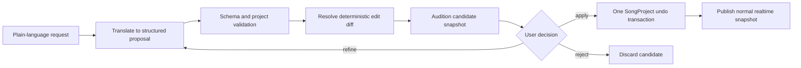

# AI-assisted music editing design

Status: M5 technical implementation candidate; the version-1 host command core, editor-owned visual A/B workflow, seeded bounded velocity transform, and explicit target/strength/seed controls are implemented, while packaged user acceptance, additional transforms, natural-language translation, and the model-service boundary remain future work

## Goal

AI assistance should feel like a powerful, inspectable editor operator—not a replacement project hidden behind a prompt box. A request such as “make this loop more aggressive but keep the melody recognizable” should become a bounded set of musical edits that the user can preview, inspect, apply, refine, and undo.

Manual and AI editing must converge on the same `SongProject` model and Undo/Redo history.

## Design rules

1. **Structured output only.** A model proposes versioned edit commands, never arbitrary C++ calls, file writes, or direct audio-thread work.
2. **Validate before preview.** Every target, range, identity, and numeric bound is checked against the active project.
3. **Preview before apply.** The UI shows a musical and structural diff, with audition where practical.
4. **One acceptance, one undo transaction.** A user-approved proposal is grouped as a named operation.
5. **No silent replacement.** Destructive replacement requires explicit confirmation; larger generations default to a new variation or section.
6. **Deterministic where possible.** Randomized operations carry an explicit seed and resolved parameters.
7. **Preserve intent and provenance.** Store a short operation description and resolved command list in history; do not require the AI service to reproduce the result later.
8. **Respect real-time boundaries.** AI, parsing, validation, and generation stay off the audio callback. Playback receives only validated immutable snapshots.
9. **Musical approval remains human.** A valid command is not automatically a good composition.

## Proposed command lifecycle



The model proposes intent. A deterministic host-side engine resolves and validates concrete edits. The active project changes only at Apply.

## Implemented M5 command and proposal boundary

The first host-side slice is deliberately service-independent:

- `schema/edit-command.schema.json` defines command version 1;
- `src/edit_command.*` strictly parses and serializes fully resolved `editNotes` commands;
- every command targets the current `track-1` / `loop-1` IDs and carries the exact active-project content SHA-256;
- add, update, and remove changes use stable note IDs and integer ticks at 960 PPQ;
- preview clones the active `SongProject`, validates all targets and bounds, applies the resolved changes only to that candidate, and returns explicit before/after note records and content hashes;
- Apply rechecks the content hash, publishes exactly the previewed changes as one named Undo transaction, and consumes the preview;
- Reject consumes the preview without changing or dirtying the active project;
- the optional integer seed is preserved as deterministic provenance in resolved commands;
- `SeededVelocityVariation` validates 1 through 128 note IDs, a 31-bit non-negative seed, and maximum delta 1 through 32, canonicalizes target order, and resolves through a fixed integer mixer into concrete velocity-only updates;
- identical project content, target set, seed, and maximum delta produce the same serialized command and candidate independently of supplied target order;
- `MainEditorComponent` owns at most one pending preview and shows its summary, counts, exact first note change, and before/after hashes;
- the piano roll draws accepted before-notes and proposed after-notes without changing active hit testing;
- Audition A and B publish either project or candidate through the normal immutable `SequenceSnapshot` path;
- explicit Apply and Reject preserve the consume-once core, Save writes only A, and unrelated project edits invalidate stale B;
- note and sound candidate controls are interlocked so the editor never presents two simultaneous A/B decisions;
- the manual producers remain deliberately bounded: transpose the selected note up one semitone, or vary velocities for the whole loop or selected note with explicit maximum delta and seed;
- the proposal card validates maximum delta `1` through `32` and seed `0` through `2147483647`, requires a current selection for selected-note scope, and freezes all request inputs while B is pending.

The content hash excludes only the editor build-version label. It includes the musical model and accepted opaque instrument state, so a command becomes stale after any material project change. Existing note timing that predates exact tick storage may be preserved byte-semantically by a pitch- or velocity-only update; any changed timing must still resolve to an integer tick at 960 PPQ. The current seeded resolver is host-side and service-independent: it records the seed, but preview and Apply use its fully resolved concrete changes rather than rerunning randomness.

## Command envelope

A future command format should include:

- command schema version;
- active project revision or content hash;
- operation type;
- explicit selection or target IDs;
- resolved musical parameters and bounds;
- optional deterministic seed;
- preconditions;
- human-readable summary;
- concrete additions, updates, removals, or generated section references.

The implemented version-1 envelope uses concrete, already-resolved note changes:

```json
{
  "commandVersion": 1,
  "projectContentSha256": "<64 hexadecimal characters>",
  "operation": "editNotes",
  "target": { "trackId": "track-1", "clipId": "loop-1" },
  "seed": 18421,
  "summary": "Increase rhythmic drive while preserving the motif",
  "changes": [
    {
      "action": "update",
      "note": {
        "id": "note-1",
        "startTick": 0,
        "lengthTicks": 720,
        "midiNote": 50,
        "velocity": 100
      }
    }
  ]
}
```

The host must reject stale project revisions, unknown IDs, unsupported operation versions, invalid ranges, or changes outside the previewed selection.

## Recommended implementation methods

### Deterministic musical transforms

Implement these first because they are easy to preview and test:

- vary whole-loop or selected-note velocity within an explicit bound and deterministic seed; this first parameterized form is implemented;
- quantize with strength rather than only hard snap;
- humanize timing and velocity within explicit bounds;
- transpose or constrain to a scale/register;
- lengthen, shorten, legato, or separate articulation;
- change density by deterministic note removal or subdivision;
- add accents, crescendos, or velocity contours;
- repeat, rotate, reverse, or sequence a motif;
- create call-and-response from selected material.

An AI can choose parameters, but the host performs the actual transformation.

### Constraint-based generation

For new material, generate into an empty variation while enforcing:

- key or pitch collection;
- chord tones and controlled non-chord tones;
- rhythmic grid and allowed tuplets;
- instrument range;
- polyphony limit;
- density and syncopation targets;
- motif similarity or contrast target;
- loop-boundary voice-leading rules;
- deterministic seed.

This is more controllable than asking a model to emit unrestricted note lists.

### Arrangement and orchestration operations

After multiple tracks and sections exist, commands can:

- create an intro, build, climax, breakdown, or ending from an existing motif;
- thin or thicken orchestration;
- move a line between instruments while respecting range;
- derive bass, harmony, counterline, or percussion roles;
- create energy variants for game states;
- reserve transition-safe bars and shared cadence points.

These operations depend on the arrangement and mixer milestones. They should not be simulated by overloading the version 1 single-loop schema.

## Mapping expressive language to controls

Words such as “aggressive,” “calm,” and “smooth” should resolve to inspectable dimensions. Defaults can be genre-sensitive, but the preview must show the chosen values.

| Intent | Possible musical changes |
| --- | --- |
| More aggressive | higher density, stronger accents, shorter articulation, more syncopation, wider register, increased harmonic tension, brighter timbre, reduced ambience |
| Calmer | lower density, softer velocity contour, longer notes, narrower register, stable harmony, slower harmonic rhythm, darker timbre, more space |
| Smoother | stronger voice leading, fewer large jumps, legato overlap, gentler automation curves, longer transitions, reduced transient contrast |
| Faster feeling without tempo change | smaller subdivisions, repeated pulses, anticipations, denser accompaniment |
| Slower feeling without tempo change | longer phrases, fewer attacks, half-time accents, sustained layers |
| More variation | motif transformations, orchestration swaps, controlled fills, alternate cadences, section-specific automation |
| More coherent | reuse motif cells, constrain pitch/rhythm vocabulary, align cadences, reduce unrelated layers |

The system should show these resolved choices rather than pretending each adjective has one universal musical meaning.

## Preview model

A proposal should create a candidate project revision or bounded patch, not mutate the live model. Useful preview views include:

- before/after notes in different colors;
- counts of added, removed, moved, and resized notes;
- parameter changes with old and new values;
- affected tracks, clips, bars, and sections;
- warnings for range, polyphony, clipping risk, missing plug-ins, or state changes;
- A/B audition that publishes the candidate through the normal immutable sequence path.

The preview engine must not create a second unsafe plug-in scan path. For opaque VST3 state, use explicit before/after snapshots and label the diff as opaque unless parameters are mapped semantically.

The implemented single-note card covers the first, second, and final bullets for note updates: orange before-note, blue after-note, add/update/remove counts, exact note detail, content hashes, and A/B sequence audition. Multi-note transforms will reuse this card; parameter, track, section, and warning views remain future extensions.

## VST3 parameter and preset edits

The first sound-editing milestone should establish host-owned parameter metadata and named state snapshots. AI should initially operate only on allowlisted parameters with known normalized ranges and stable identifiers.

Native Surge UI changes create a special case: the host can capture before and after state blobs, but cannot always explain their semantic byte diff. A safe first design is to group an explicitly captured sound change as one undoable opaque-state transaction while separately tracking any parameters the host can identify.

Never let a model invoke arbitrary plug-in UI automation, scan untrusted bundles, or assume that the same parameter index means the same thing in another plug-in version.

## Game-music operations

After ordinary arrangement is dependable, AI can help build:

- intensity variants that share tempo, meter, phrase length, and cadence anchors;
- horizontal transitions between sections at legal musical exit points;
- vertical layering plans with compatible stems;
- loop-tail and reverb-tail handling;
- alternate combat, exploration, tension, victory, and recovery arrangements derived from common motifs;
- engine-facing transition metadata.

These remain music operations. General sound-effect generation is outside Resonance's scope.

## Privacy and service boundary

Before connecting any hosted AI service, define what can leave the machine. Prefer sending symbolic selections, summaries, and bounded metadata rather than VST3 binaries, opaque state, installed plug-in paths, full project history, or rendered audio by default. Make service use explicit and document retention assumptions.

Local deterministic transforms should work without an AI service. The editor must remain usable manually when AI is unavailable.

## Minimum viable AI milestone

The first AI slice should be intentionally small:

1. introduce a versioned edit-command schema;
2. support a few note-only operations on the current clip;
3. translate one natural-language request into those operations;
4. validate against an exact project revision;
5. show a before/after note diff;
6. audition without changing the active project;
7. apply as one Undo transaction or reject with no mutation;
8. cover deterministic resolution, stale proposals, invalid IDs, bounds, and round trips with tests.

Items 1, 2, 4, 5, 6, 7, and the host-side portions of item 8 now have native coverage, including deterministic multi-note resolution and explicit bounded host inputs. The remaining M5 gate is packaged user review of control clarity and musical usefulness. Natural-language translation remains intentionally deferred to the later AI milestone rather than being folded into M5 acceptance.

Do not begin with open-ended “make a whole soundtrack” generation. The command and preview contract must become trustworthy first.
