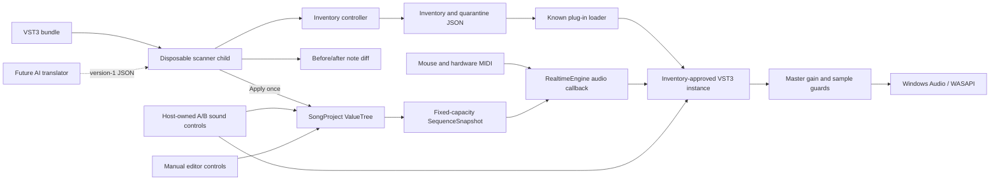

# Architecture

Status: current implementation reference for project version 0.3.0

## System at a glance

Resonance is a C++20/JUCE 9 Windows application with four production executables. The interactive editor never discovers an unknown VST3 during startup. Discovery happens in a disposable scanner child, an inventory controller accepts or quarantines the result, and the editor later loads one exact known bundle from that inventory.

Solid lines are implemented host-side boundaries. The dotted AI translation path and the editor-facing command preview UI are not implemented.

## Production executables

| Executable | Responsibility | Runs a plug-in? |
| --- | --- | --- |
| `ResonanceMusicEditor.exe` | Interactive editor, project lifecycle, real-time audio, piano roll, and native Surge window | Yes, only after accepted-inventory validation |
| `ResonanceHostProbe.exe` | One-shot compatibility probe and diagnostic offline render | Yes, from an explicit path |
| `ResonancePluginScanner.exe` | One-bundle discovery and capability report | Yes, in a disposable process |
| `ResonancePluginInventory.exe` | Child timeout, report validation, inventory update, and quarantine update | No |

`ScannerHangFixture.exe`, `RealtimeEngineTests.exe`, and `SongProjectTests.exe` are development-only binaries and are not copied to `bin`.

## Source ownership map

| Area | Main files | Owns |
| --- | --- | --- |
| Application lifecycle | `src/realtime_main.cpp` | arguments, settings, window creation, self-test, UI snapshot, idle test |
| Main UI | `src/editor_component.*` | transport, device controls, file choosers, project actions, native plug-in window |
| Piano roll | `src/piano_roll.*` | note hit testing, selection, add, move, resize, delete, vertical scroll |
| Song model | `src/song_project.*` | ValueTree state, stable note IDs, Undo/Redo, JSON conversion, validation |
| Edit-command core | `src/edit_command.*` | strict version-1 parsing, content-hash preconditions, candidate projects, note diffs, consume-once Apply/Reject |
| Scheduling | `src/loop_scheduler.h` | sample-offset MIDI events, note wrap, fixed-capacity sequence contract |
| Audio engine | `src/realtime_engine.*` | device callback, transport, MIDI merge, VST3 processing, gain, meters, guards |
| Accepted plug-in load | `src/known_plugin.*` | inventory/quarantine parse, exact bundle revalidation, selected instrument record |
| Plug-in identity | `src/plugin_identity.h` | relocation-compatible saved-project VST3 UID matching |
| Bundle identity | `src/plugin_bundle_identity.h` | deterministic file manifest and SHA-256 bundle fingerprint |
| Scanner | `src/scanner_main.cpp` | discovery, instantiation, capabilities, state, structured report |
| Inventory controller | `src/inventory_main.cpp` | child process boundary, deadlines, atomic accepted/quarantine collections |
| Compatibility probe | `src/main.cpp` | state round trip, MIDI delivery, editor creation, offline render report |

## Interactive ownership

`MainEditorComponent` owns one `SongProject`, one `RealtimeEngine`, one device manager, one accepted plug-in record, and the editor controls. The project is the authoritative symbolic state. UI operations modify the project; its change callback refreshes controls and publishes a new sequence snapshot.

The current model contains:

- one title, sample rate, tempo, meter, snap value, and loop length;
- one instrument track;
- one VST3 identity and opaque state blob;
- one accepted sound name paired with that opaque state and SHA-256;
- one loop clip;
- up to 512 notes with stable IDs, tick timing, pitch, and velocity.

The plug-in instance belongs to the real-time engine. The native Surge window is a view over that same instance, not a second synth.

## Thread model

### Message thread

The JUCE message thread owns widgets, file dialogs, the ValueTree model, project Undo/Redo, and creation or destruction of the native plug-in editor. It may allocate and perform file I/O. It must not poll expensive plug-in capability methods from paint or timer callbacks.

### Audio callback

The device callback owns time-critical scheduling and processing. It:

1. clears exactly the requested output span;
2. reads a published immutable sequence slot;
3. schedules loop note events at sample offsets;
4. merges mouse-keyboard and hardware MIDI;
5. updates the plug-in playhead;
6. calls the accepted VST3 with a buffer view whose length equals the device callback length;
7. applies smoothed master gain;
8. replaces non-finite values, limits out-of-range samples, and updates diagnostic counters.

### Scanner child

Each scan runs in its own process. The parent does not pipe arbitrary plug-in stdout or stderr. It waits for a bounded report, terminates a timeout, and records a bounded failure in quarantine.

## Real-time invariants

Changes to `RealtimeEngine`, `LoopScheduler`, or the model-to-engine boundary must preserve these rules:

- no disk access from the audio callback;
- no UI work from the audio callback;
- no unbounded container growth in the audio callback;
- no wait on a message-thread lock;
- no plug-in capability probing in a steady-state timer;
- process only the exact device-supplied sample count;
- transport starts stopped;
- master gain starts at `-12 dB`;
- stop and panic produce note-off/all-sound-off behavior;
- invalid and clipped samples are counted and bounded;
- automated self-test remains silent.

### Sequence publication

The message thread converts the project notes into a `SequenceSnapshot` with a fixed array of 512 entries. The engine maintains two sequence slots. A writer publishes into a slot that has no readers; the callback takes a non-blocking reader claim on the current slot, schedules it, and releases it. If an immediate publish is unavailable, the latest pending snapshot can be retried without making the callback wait.

### Plug-in state operations

State capture and restore use a separate plug-in-access critical section. The audio callback attempts that lock rather than waiting for it. A concurrent save or restore may therefore produce a silent callback block, but it cannot block the real-time thread indefinitely.

The M4 sound workflow keeps A in `SongProject` and B as an ephemeral `PluginSoundSnapshot` owned by the editor component. Capture B reads the live state only on an explicit button action. Audition restores A or B through the same engine boundary without changing the project. Apply writes the candidate name, Base64 state, and hash as one ValueTree Undo transaction. Global Undo/Redo compares the accepted project hash before and after the history operation and restores the live plug-in only when that hash changed.

Opaque state bytes are not assumed to be a semantic sound fingerprint. `RealtimeEngine::restorePluginState` can recapture the plug-in state while holding the same access lock. The editor keeps that post-restore hash as an ephemeral live-equivalent A or B identity for UI selection and discard comparisons, while the project retains the original exact bytes and SHA-256 for persistence integrity. This prevents lifecycle reserialization from masquerading as an uncaptured sound edit without rewriting the saved payload.

## Project save and open transactions

### Save

1. Require a valid accepted sound snapshot already owned by the project.
2. Update current identity metadata and the supported live sample rate.
3. Serialize the complete schema version 1 document in memory.
4. Write it through JUCE's `replaceWithText` operation.
5. Mark the project clean after a successful save.

An unapplied B or arbitrary native Surge edit is preview state. Save never replaces A with whichever state happens to be live.

### Open

1. Parse into a separate candidate `SongProject`.
2. Validate schema, ranges, identities, note IDs, state encoding, and state hash.
3. Check that the saved VST3 identifier is compatible with the currently accepted instrument.
4. Restore the candidate plug-in state into the live instance.
5. Replace the active project only after every preceding step succeeds.
6. Publish the new sequence and mark it clean.

This order prevents a malformed file or failed state restore from partially replacing the active song.

## Plug-in trust boundary

Scanner isolation is a reliability boundary, not a security sandbox. A VST3 is native code running with the user's permissions. The interactive editor verifies accepted inventory, quarantine state, module existence, file count, byte count, and the full bundle fingerprint before loading, but a loaded plug-in can still crash or stall the editor.

See [VST3 hosting](VST3_HOSTING.md) and [ADR-0002](ADR-0002-crash-isolated-plugin-scanning.md) for the complete lifecycle.

## Extension seams

The current single-track shape is deliberate, but several seams are intended for growth:

- `SongProject` can evolve from one track and clip into track and arrangement collections through an explicit schema migration.
- structured edit commands now sit above the same note operations and Undo manager used by the piano roll; their visual preview and audition controls remain to be connected;
- `SequenceSnapshot` can become a per-track render snapshot without exposing the mutable ValueTree to audio code;
- the engine can grow a graph or mixer while keeping device callback rules intact;
- automation can publish fixed-capacity curves or block-local parameter events;
- offline rendering can reuse the validated song and plug-in state while remaining separate from the device callback;
- game-transition metadata can reference arrangement sections after ordinary arrangement editing exists.

These are extension points, not permission to weaken current invariants. Multi-track, automation, AI translation/service integration, edit-command preview UI, effects, and game-state playback are not implemented yet.

## Architectural evidence

The durable decisions are recorded in the four ADRs. Dated checkpoints under `docs/` provide reproduction commands and measurements for scanning, real-time playback, the startup-freeze fix, native Surge audition, editable projects, the accepted M4 sound workflow, and the M5 edit-command foundation. See the [documentation index](README.md) for the full list.
