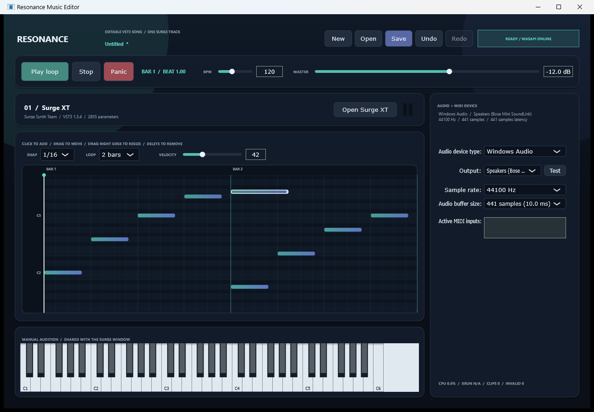

# Editable song checkpoint - 2026-08-08

## Result

Accepted as a technical implementation gate. Resonance now has one real editable Surge XT track backed by a versioned, lossless song project.

The piano roll supports:

- click-to-add and selected-note highlighting;
- drag-to-move beat and pitch;
- right-edge drag to resize;
- right-click or Delete to remove;
- `1/32`, `1/16`, `1/8`, and `1/4` snap;
- velocity 1-127;
- one-, two-, four-, and eight-bar loop lengths;
- gesture-level Undo/Redo and keyboard shortcuts;
- editing while the sample-accurate loop continues to play.

New, Open, Save, Undo, and Redo share the same `SongProject` model as playback. Unsaved edits are marked and protected by a discard confirmation.

## Project contract

`.resonance.json` schema version 1 stores:

- title, sample rate, 960 PPQ, tempo map, 4/4 meter, and editor snap;
- one stable VST3 identity with name, vendor, and version;
- Base64 Surge state plus SHA-256 integrity hash;
- one looping clip with stable note IDs, integer ticks, pitch, and velocity.

Load is transactional. The file is parsed and validated, the plugin identifier and state hash are checked, and Surge state is restored before the active project is replaced.

## Real-time boundary

The message thread publishes fixed-capacity immutable `SequenceSnapshot` buffers. The audio callback acquires a reader slot without allocation or blocking, schedules the current notes, and releases it before processing Surge.

Plugin-state save/restore uses a separate critical section. The audio callback uses a try-lock, so a state operation can produce a silent block but cannot block the real-time thread. Ordinary note edits do not take that plugin-state lock.

## Recorded checks

| Check | Result |
| --- | --- |
| Scheduler assertions | 79 passed |
| Song-model assertions | 37 passed |
| JSON/schema artifacts | 11 passed |
| Real Surge state bytes | 67,340 |
| Real Surge state SHA-256 | `390b5b0d5ac2d8be85fe48c74d62ea0503b7be019cda2b68e0ec889ac44c74d0` |
| Real self-test project bytes | 91,334 |
| Saved state payload exact | Passed |
| Surge restore/recapture exact | Passed |
| Native Save/Open | Passed |
| Native velocity Undo/Redo | 42 -> 96 -> 42 |
| Windows Audio device | 44.1 kHz / 441 samples |
| UI idle regression | 1,171.9 ms CPU / 5,519 ms wall |
| Automated audio emitted | No |

## Visual evidence

The live Windows QA also exposed and corrected two interaction bugs before acceptance: accessibility/text-entry velocity changes were initially grouped with the preceding resize, and Redo controls refreshed before Undo had fully completed.

## Reproducible artifacts

- `artifacts/realtime-song-project.resonance.json` - deterministic real-Surge round trip with nine notes and a 16-beat loop.
- `artifacts/ui-save-open-roundtrip.resonance.json` - project created and reopened through the native Windows chooser.
- `artifacts/song-project-test-report.json` - model and serialization assertions.
- `schema/song-project.schema.json` - versioned file contract.

## Scope boundary

This gate proves editing, scheduling, state persistence, UI behavior, and lifecycle safety for one Surge track. It does not approve the musical quality of the starter notes or current preset, and it does not yet provide multiple tracks, arrangement sections, automation, AI editing, or game-transition exports.
