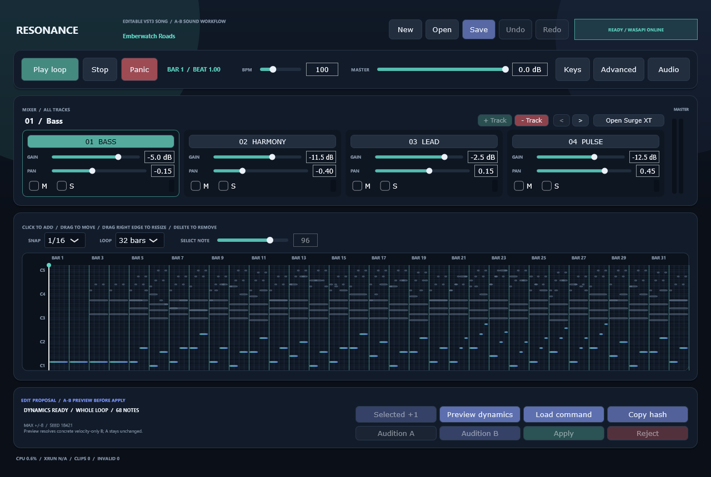
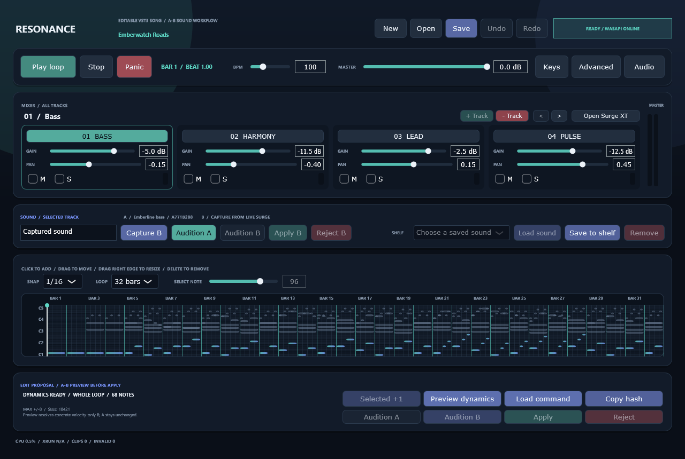

# Sound lane layout regression fix

Date: 2026-08-15

Status: implementation evidence only. No listening approval.

## What was broken

Every control in the host-owned sound workflow was unreachable in the GUI:

| Control | State |
| --- | --- |
| `soundNameEditor`, `captureSoundButton` | constructed, wired, never positioned |
| `auditionProjectSoundButton`, `auditionCandidateButton` | constructed, wired, never positioned |
| `applySoundButton`, `rejectSoundButton` | constructed, wired, never positioned |
| `shelfLabel`, `shelfCombo` | constructed, wired, never positioned |
| `loadShelfButton`, `saveShelfButton`, `removeShelfButton` | constructed, wired, never positioned |
| `soundWorkflowLabel` | constructed, updated by `updateStatus`, never positioned |

All twelve were still `addAndMakeVisible`d, still coloured, still had their
`onClick` handlers, and were still correctly enabled and disabled by
`updateStatus()`. Only `setBounds` was missing, so each sat at its default
zero-size rectangle at the origin: present in the component tree, invisible on
screen, and impossible to click.

The effect was that **M4 — the milestone `HANDOFF.md` records as explicitly
user-accepted — could not be exercised at all**, and `setSound` was inert in
practice because the shelf it reads could never be filled.

## Where it came from

`0e5aacf` "Rebuild the editor layout around the music" replaced the single-track
mixer row with four per-track strips. The two rows that had lived underneath it
inside the track card, the sound row and the shelf row, were removed from
`resized()` and never re-added anywhere.

```
git show 0e5aacf^:src/editor_component.cpp | grep -c '<sound control>\.setBounds'   # 5
git show 0e5aacf:src/editor_component.cpp  | grep -c '<sound control>\.setBounds'   # 0
```

## How it survived every gate

This is trap 6 in `HANDOFF.md` — *paint code compiling is not paint code
working* — in its most literal form. Nothing detects it:

- it compiles, because `setBounds` is not required;
- the packaged sound-shelf and M4/M5 regressions drive the model and the shelf
  directly rather than through mouse input, so they pass against controls that
  are not on screen;
- the UI snapshot gate compares nothing. It records a byte count and a hash, and
  a control with no bounds simply draws nothing, so the snapshot after the
  rebuild was self-consistent and looked fine;
- the UI idle gate measures CPU, not layout.

It was found by a user going to shelf a patch, failing to find any control, and
saving inside Surge's own browser instead — which writes a vendor `.fxp` that
ADR-0004 deliberately refuses to read, so the shelf stayed empty and the
confusion compounded.

## What changed

A dedicated sound card now sits between the mixer and the piano roll, carrying
the caption, the live A/B status label, and both lanes.

The lanes sit side by side on a window wide enough for them and stack when it is
not, so the piano roll pays 82 pixels rather than 116 at the default 1280 x 860.
The threshold is derived from the control widths rather than written as a
constant, so it cannot drift away from them.

Control widths and order are unchanged from the pre-rebuild layout.

## Evidence

| Check | Result |
| --- | --- |
| Scheduler/mixer/runtime assertions | 124 passed |
| Project/migration/command/placement assertions | 338 passed |
| `SoundShelfLanePassed` | true |
| Schema-validated artifacts | 26 passed |
| UI idle gate | 1,953.1 ms CPU, below the 3,000 ms ceiling |
| UI snapshot | 87,189 bytes, SHA-256 `85ef37fa…` |
| Every control visibly drawn and correctly enabled | verified by snapshot |

The snapshot is the check that carries information here, because it is the only
one that can observe a control that draws nothing.



Above, the defect: the mixer card runs straight into the piano-roll card and
nothing between them offers a way to capture, audition, or shelf a sound.



Below it, the fix, with `Audition B`, `Apply B` and `Reject B` correctly disabled
against no pending candidate, and `Load sound` and `Remove` correctly disabled
against an empty shelf.

## A stale report schema found alongside it

`schema/command-load-test.schema.json` still constrained `commandVersion` to
`[1, 2]` after `a9705c9` raised the authored version to 3, so
`scripts/validate-artifacts.py` — one of the four first-takeover commands — had
been failing on the tip. Its enum now accepts 3. This is trap 3, a schema bump
touching more than the schema.

## What this does not do

- No listening approval. Nothing since M5 has any.
- Mouse gestures over the restored controls are still verified by screenshot
  rather than by an automated test, so the same class of defect remains possible
  in any future layout change. A gate that asserts every registered control has
  a non-empty bounds rectangle would close it, and does not exist yet.
