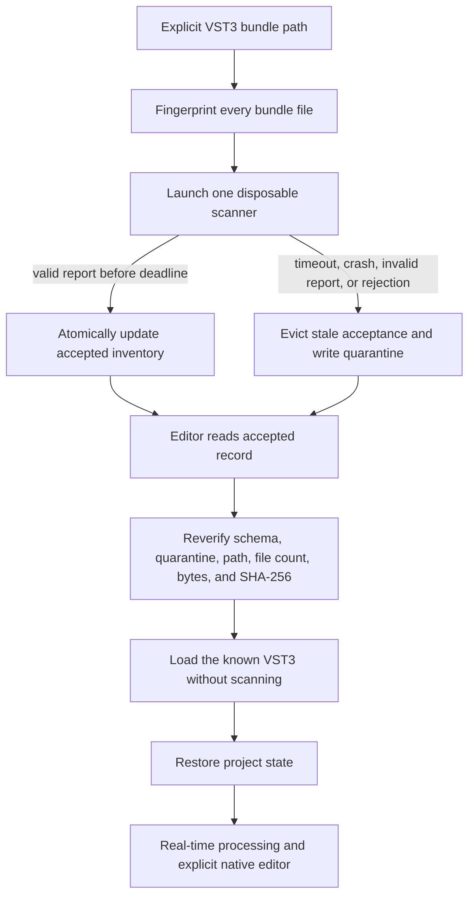

# VST3 hosting and plug-in lifecycle

Status: current single-instrument implementation and safety rules

## Why VST3 is foundational

Resonance started again with real plug-in hosting instead of building a music editor around one weak internal sound per instrument. The project model owns notes and musical structure, while a VST3 owns synthesis and opaque instrument state. Surge XT 1.3.4 is the first compatibility target, not a permanent one-synth limitation.

The current build enables VST3 hosting only. It does not enable VST2, Audio Units, LV2, LADSPA, ARA, ASIO, or DirectSound.

## Lifecycle overview

## Bundle identity

`identifyBundle` recursively enumerates files in the `.vst3` bundle, sorts their relative paths case-insensitively, and creates a manifest containing each relative path, byte count, and file SHA-256. The SHA-256 of that manifest is the bundle fingerprint. Inventory also stores the file count and total bytes.

This detects a changed or partially replaced bundle before editor load. It is not publisher authentication. Code signing and vendor trust policy remain future work.

## Disposable scanner

`ResonancePluginScanner.exe` accepts one explicit bundle and one report path. It discovers VST3 types, chooses an instrument, instantiates it, records identity and capabilities, captures state, and writes a bounded structured report. It does not create the native plug-in editor during discovery.

Running the scanner directly is useful for development, but production acceptance goes through `ResonancePluginInventory.exe`, which owns the child deadline and state transitions.

## Inventory controller

The controller:

1. validates input paths and fingerprints the bundle;
2. launches a unique scanner child and temporary report;
3. waits for 50 through 120,000 ms, with 20,000 ms as the normal default;
4. terminates a child that exceeds the deadline;
5. validates success as exit code 0 plus `passed: true` in a usable report;
6. evicts any prior accepted record for that bundle after failure;
7. writes a quarantine entry for launch, timeout, scanner-exit, report, or validation failure;
8. on success, updates inventory and removes that path from quarantine.

The forced-timeout contract returns code 21. A scanner failure routed through the controller returns code 22. The scanner-isolation test covers both paths before accepting real Surge.

Inventory and quarantine are two files, but the loader fails closed: quarantine wins if the same path appears in both. Updates use bounded JSON collections and replace the relevant path entry rather than accumulating duplicate current records.

## Accepted editor load

The interactive editor does not call the scanner. `loadFirstAcceptedInstrument`:

- requires inventory and quarantine schema version 1;
- chooses the first accepted VST3 instrument record;
- reconstructs its JUCE `PluginDescription`;
- checks that the description reproduces the recorded scanned-path identifier;
- requires the bundle and module to exist;
- refuses a quarantined path;
- recomputes fingerprint, file count, and total bytes;
- returns the record only when every check passes.

The editor then instantiates that known description. This avoids turning editor startup or song opening into an implicit discovery operation.

## Identifier and relocation behavior

JUCE's VST3 identifier contains a path-sensitive portion and a final UID-derived suffix. The current Surge UID suffix is `-190e4fbd`. Therefore:

- the **inventory identifier** must exactly reproduce the current scanned path and description;
- a **saved project identifier** may match the active instrument exactly or by matching VST3 prefix and the same UID suffix;
- the plug-in name must also match when opening a project;
- moving a bundle still requires a rescan because inventory contains its absolute current path and fingerprint;
- matching only a display name is never enough.

This policy is implemented in `src/plugin_identity.h` and covered by project tests. It makes saved songs portable across a relocation of the same VST3 identity without letting an unrelated instrument inherit its state.

## Opaque state

The host captures VST3 state as bytes, stores it as Base64, and records its SHA-256 in the song. On open, the bytes must decode and match the hash before they are handed to the plug-in.

Opaque state has important consequences:

- the editor can preserve sound without understanding every Surge parameter;
- exact state round trips can be tested;
- state format compatibility ultimately belongs to the plug-in vendor;
- an editor UI may add non-audible metadata to later state captures;
- a state hash difference is evidence of byte change, not automatically evidence of audible change;
- project files can become large, so future history and variation storage should avoid careless duplication.

## Host-owned sound snapshots

The first M4 workflow deliberately uses opaque snapshots instead of pretending VST3 exposes a uniform preset browser. The accepted Surge inventory reports zero host programs, while the portable content contains thousands of Surge-specific `.fxp` files. Resonance therefore does not parse or index those files in this slice.

The project owns A: a sound name, Base64 state, and exact payload SHA-256. The editor may hold one ephemeral B candidate captured explicitly from the live instance. A/B audition restores either snapshot through `RealtimeEngine::restorePluginState`; Apply writes B through the project Undo manager; Reject restores A. Save serializes A even if B or an uncaptured native edit is live.

Surge may reserialize the same restored sound into different opaque bytes as its lifecycle changes. Restore therefore recaptures the state under the same plug-in lock, and the editor tracks that post-restore hash as the live-equivalent A or B identity. UI selection and discard checks use the live-equivalent identity; project loading and saving continue to validate and preserve the exact stored payload. This is state-boundary bookkeeping, not Surge-specific preset parsing.

Snapshot capture is never polled. The state lock retains its existing rule: the audio callback uses a try-lock and may emit a silent block while a message-thread capture or restore owns plug-in access. See [ADR-0004](ADR-0004-host-owned-sound-snapshots.md).

## Native editor behavior

The Surge native editor is created only after the user explicitly presses **Open Surge XT**. Resonance adds an audition strip above the same native view with Play/Pause, Stop, Panic, and a C1-C7 mouse keyboard. It drives the same engine and instrument as the main window.

Do not poll `AudioPluginInstance::hasEditor()` from a timer. JUCE's VST3 implementation may create and release a native view to answer that call. The scanner records `hasEditor` once, the interactive UI uses that cached value, and the real view is created only on command.

Closing the native window hides it and requests panic so held audition notes do not continue. Reopening reuses the existing editor instance rather than repeating a capability probe.

## Real-time risk

The scanner child contains discovery crashes and hangs only. After loading, the VST3 runs in the interactive editor process and its `processBlock` participates in the audio callback. A plug-in crash or unbounded stall can still terminate or freeze the editor.

The current host catches C++ exceptions around processing where possible, counts processor exceptions, silences unavailable paths, limits output samples, and exposes diagnostics. Those guards cannot recover from every native fault.

## Adding additional plug-ins

Multi-plug-in support is planned, not implemented. A future browser should not simply scan every installed folder on editor startup. It should:

1. make discovery an explicit background operation through the isolated controller;
2. show accepted, changed, missing, and quarantined states;
3. support explicit rescan and quarantine repair;
4. distinguish instruments from effects;
5. define duplicate version and UID policy;
6. preserve missing-plug-in project data without destructive substitution;
7. test each new plug-in against state, editor, MIDI, bus, latency, tail, and lifecycle contracts;
8. keep third-party content outside the repository and project package.

## Current evidence

The current relocated machine inventory contains one accepted Surge XT 1.3.4 instrument with 2,855 parameters, native-editor capability, and UID suffix `190e4fbd`; production quarantine is empty. Machine-specific inventory values are regenerated locally and are not versioned. Historical measurements and pre-relocation identifiers remain in the dated scanner and real-time checkpoint files.

See [ADR-0001](ADR-0001-vst3-host-foundation.md), [ADR-0002](ADR-0002-crash-isolated-plugin-scanning.md), [ADR-0003](ADR-0003-realtime-audio-engine.md), [ADR-0004](ADR-0004-host-owned-sound-snapshots.md), and [Testing and release](TESTING_AND_RELEASE.md).
